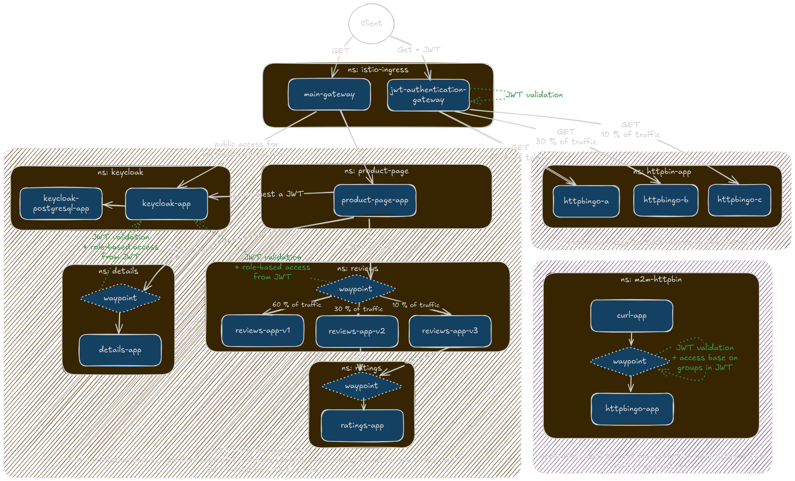

# There-Is-No-Point

**This project has no point. Literally.**

It’s a personal portfolio that showcases my skills as a DevOps engineer, built around
experimentation, automation, and continuous learning.

I’ve been working as a DevOps Engineer for 5 years, and I felt it was time to take stock of what
I’ve learned. This project gives me a space to practice, explore, and experiment with DevOps
patterns and tools.

The goal is to deploy a Kubernetes cluster running a set of microservices. I’m not aiming to build a
specific software application, but rather to design a reproducible Kubernetes platform composed of
interconnected open-source microservices.

The platform is bootstrappable locally, using [k3d](https://k3d.io/stable/) to spin up a lightweight
Kubernetes cluster.

______________________________________________________________________

**Table of Contents**

<!-- mdformat-toc start --slug=github --no-anchors --maxlevel=6 --minlevel=2 -->

- [🏗️ System Design](#%F0%9F%8F%97%EF%B8%8F-system-design)
  - [Overview](#overview)
  - [Architecture Diagram](#architecture-diagram)
    - [Istio bookinfo application](#istio-bookinfo-application)
    - [httpbingo: testing Access to the Platform](#httpbingo-testing-access-to-the-platform)
    - [m2m-httpbingo: service-to-service communication tests](#m2m-httpbingo-service-to-service-communication-tests)
  - [Security & Networking](#security--networking)
- [🚀 Deployment](#%F0%9F%9A%80-deployment)
  - [Prerequisites](#prerequisites)
  - [Deploy](#deploy)
  - [Useful bash scripts!](#useful-bash-scripts)
  - [Local Development Flow](#local-development-flow)
- [🚧 Future Work](#%F0%9F%9A%A7-future-work)
- [⚙️ Tech Stack](#%E2%9A%99%EF%B8%8F-tech-stack)
  - [Infrastructure](#infrastructure)
  - [Development](#development)
    - [Python](#python)

<!-- mdformat-toc end -->

## 🏗️ System Design

### Overview

The system is designed to explore DevOps and service-mesh patterns:

- Fine-grained traffic management (Gateway API, Authorization Policies, JWT validation)
- Authentication and identity propagation through Keycloak
- Automated deployments via Helmfile and Tilt

### Architecture Diagram



#### Istio bookinfo application

This project uses a customized version of the classic
[Istio Bookinfo](https://github.com/istio/istio/tree/master/samples/bookinfo) demo application. It
serves as the main functional workload of the cluster.

Two demo users are preconfigured in Keycloak:

| Username    | Password   | Access Rights                               |
| ----------- | ---------- | ------------------------------------------- |
| `alice`     | `alicepwd` | Full access to Reviews and Details services |
| `bob`       | `bobpwd`   | Access to Details                           |
| `anonymous` |            | Access to nothing                           |

Depending on the logged-in user, certain endpoints of `reviews` or `details` will be allowed or
denied.

Access application and login page: http://productpage.there-is-no-point.localhost/productpage

#### httpbingo: testing Access to the Platform

[`go-httpbin`](https://github.com/mccutchen/go-httpbin) is deployed as a simple HTTP echo service to
test the platform’s external access and authentication. It verify JWT-based authentication at the
Gateway level

Require valid jwt to access the application:

```bash
TOKEN=$(curl https://raw.githubusercontent.com/istio/istio/release-1.27/security/tools/jwt/samples/demo.jwt -s)
curl -H "Authorization: Bearer $TOKEN" http://httpbin.there-is-no-point.localhost/get
```

#### m2m-httpbingo: service-to-service communication tests

`m2m-httpbingo` is a private instance of httpbingo, deployed inside the mesh, not exposed through
the Gateway. It’s used to test internal service-to-service communication.

### Security & Networking

- All inter-service traffic is encrypted via Istio Ambient mTLS
- Authentication and authorization enforced via:
  - JWT validation (Keycloak-issued tokens)
  - AuthorizationPolicies in Istio

## 🚀 Deployment

### Prerequisites

1. Install `k3d`, `kubectl`, `Docker`, `helm`, `helmfile`, `yq`

### Deploy

1. Start the local cluster

```bash
k3d cluster create --config k3d/config.yaml
```

2. Deploy the application

```bash
# build and deploy custom product page image
cd apps/productpage
docker build --target runner -t registry.localhost:5000/istio/examples-bookinfo-productpage-v1:1.20.3 .
docker push registry.localhost:5000/istio/examples-bookinfo-productpage-v1:1.20.3
cd -
# deploy all microservices
helmfile sync
```

3. Access the services

- Product Page — http://productpage.there-is-no-point.localhost/productpage
- Keycloak — http://keycloak.there-is-no-point.localhost/
- Httpbin (JWT required) — http://httpbin.there-is-no-point.localhost/get

### Useful bash scripts!

```bash
# Launch cluster and run tests
./scripts/run.sh

# Launch cluster (equivalent to the above instructions)
./scripts/cluster/cluster.sh

# delete cluster
./scripts/delete.sh
```

### Local Development Flow

```bash
cd apps/productpage
tilt up
```

## 🚧 Future Work

> _Planned improvements and future experiments._

- Add CI/CD pipelines with GitHub Actions
- Add monitoring stack: `Prometheus`, `Grafana`, `Kiali`
- Integrate `OpenTelemetry` tracing
- Add rate limiting via Istio policies
- Add `cert-manager` for automatic TLS management
- Test the other authentication flows (Keycloak redirect & Node-based)
- Implement a front-end dashboard (JavaScript)
- Add GitOps tooling (`ArgoCD` / `FluxCD`)
- Secure secret management
- Create a deployment flow to `Scaleway` 🥖 with `Terraform`

## ⚙️ Tech Stack

> _This list will evolve as the project grows._

### Infrastructure

Runs on a Kubernetes-based microservice architecture.

- **`Kubernetes`** — managed locally via [`k3d`](https://k3d.io/stable/)
- **`Helm`** — orchestrated with [`Helmfile`](https://helmfile.readthedocs.io/en/latest/)
- **`Istio`** — running in [`Ambient mode`](https://istio.io/latest/docs/ambient/overview/) and
  leveraging the [`Kubernetes Gateway API`](https://gateway-api.sigs.k8s.io/)
- [**`Keycloak`**](https://www.keycloak.org/) — for authentication and user federation
- _(Planned): `Prometheus`, `Grafana`, `Kiali`_

### Development

- [**`Tilt`**](https://tilt.dev/) — automated local development and live reload
- **`Docker`** — multi-stage builds for production and development environments

#### Python

- [**`uv`**](https://docs.astral.sh/uv/) — dependency and environment management
- _(Planned): `Pydantic BaseSettings`, `Ruff`, `mypy`, `Pytest`. see:
  [README.md](./apps/productpage/README.md#TODO)_
